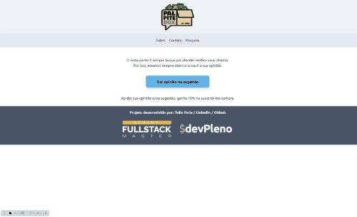

<p align="center">
   
</p>

# PalpiteBOX

This project is part of the [Devpleno](http://devpleno.com/) course and consists of a website that the client can rate the restaurant and receive a coupom for it! We mainly use [React](https://reactjs.org), [Next.js](https://nextjs.org/) and [Tailwind](https://tailwindcss.com/docs/installation). [Google Sheets](https://www.google.com/sheets/about/) were used to record the data from the form.

<br />
<p align="center">
    
</p>

---

# :guide: Guide

* [Features](#features)
* [Installation](#installation)
* [Technologies](#techs)
* [Future Implementations](#future)


# :features: Features

*  Users can rate the restaurant and receive a coupon for it.
*  Administrators could use an Google Sheet to record the data.
*  Administrators could do some Promotions and change it texts.


# :installation: Installation

**You will need install:**

 [Node.js](https://nodejs.org/en/download/) <br />
 [Npm](https://www.npmjs.com/) 

**Install dependencies**

```npm install```

**Enviroment variables**

There´s an example from the enviroment variables available at ```.env.example```


**Run the application in a development environment:**

```npm run dev```

# :techs: Technologies

* [NodeJS](https://nodejs.org/en/) to handle the server, 
* [React](https://reactjs.org) and [Nexjs](https://nodejs.org/en/) to handle the rendering, 
* [Tailwindcss](https://tailwindcss.com/) to handle styles and layout
* [Google Sheets](https://www.google.com/sheets/about/) to record data

# :future: Future Implementations

We could add some photos from the restaurant and a forMail.
##


